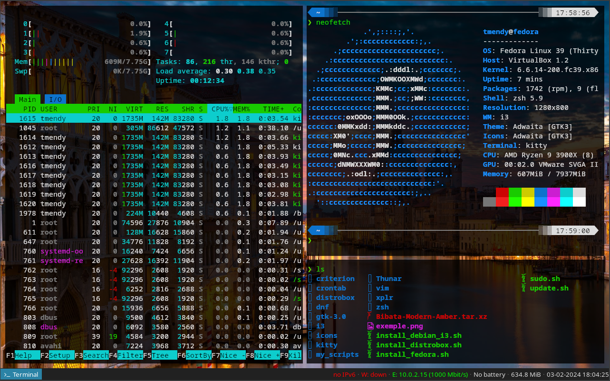

# dofiles

- install_debian_i3.sh = auto install my debian configuration with i3wm
this install script take ~ 20 min to complete

- install_fedora.sh = auto install my utily program for fedora

Work In Progress

## A list of (cool) programs & tools I am currently using   

This list is not exhaustive, these are the tools I use on a daily basis and could do without.

### DE
- Window manager : [i3](https://i3wm.org)
- Screen locker : [i3lock-fancy](https://github.com/meskarune/i3lock-fancy)
- Status bar : [i3satus](https://i3wm.org/docs/i3status.html)
- App launcher : [rofi](https://github.com/davatorium/rofi)
- Notification : [dunst](https://github.com/dunst-project/dunst)

### Package manager
- Apt front-end : [nala](https://gitlab.com/volian/nala)
- 🦀: [cargo](https://doc.rust-lang.org/cargo/)

### Term
- Terminal emulator : [kitty](https://sw.kovidgoyal.net/kitty/)
- Shell prompt : [10kpowerline](https://github.com/romkatv/powerlevel10k)
- Shell : [zsh](https://www.zsh.org/)
- Plugin manager : [zinit](https://github.com/zdharma-continuum/zinit)

### Editor
- Editor : [neovim](https://neovim.io/)
- Plugin Manager : [Lazy](https://github.com/folke/lazy.nvim)
    - [nvim-lualine/lualine.nvim](https://github.com/nvim-lualine/lualine)
    - [oknozor/illumination](https://github.com/oknozor/illumination)
    - [scrooloose/nerdtree](https://github.com/scrooloose/nerdtree)
    - [Raimondi/delimitMate](https://github.com/Raimondi/delimitMate)
    - [airblade/vim-gitgutter](https://github.com/airblade/vim-gitgutter)
    - [RRethy/vim-illuminate](https://github.com/RRethy/vim-illuminate)
    - [airblade/vim-rooter](https://github.com/airblade/vim-rooter)
    - [tpope/vim-fugitive](https://github.com/tpope/vim-fugitive)
    - [pearofducks/ansible-vim](https://github.com/pearofducks/ansible-vim)
    - [rust-lang/rust.vim](https://github.com/rust-lang/rust.vim)
    - [aliou/bats.vim](https://github.com/aliou/bats.vim)
    - [hashivim/vim-vagrant](https://github.com/hashivim/vim-vagrant)
    - [chr4/nginx.vim](https://github.com/chr4/nginx.vim)
    - [cespare/vim-toml](https://github.com/cespare/vim-toml)
    - [neoclide/coc.nvim](https://github.com/neoclide/coc.nvim)

**Note :** [here is a cheatsheet](docs/nvim_cheatsheet.md) for the nvim config 

### Cli tools
- Grep replacement : [ripgrep](https://github.com/BurntSushi/ripgrep)
- Find replacement : [fd](https://github.com/sharkdp/fd)
- Cat replacement : [bat](https://github.com/sharkdp/bat) 
- Hexdump replacement : [hexyl](https://github.com/sharkdp/hexyl) 
- du replacement : [dust](https://github.com/bootandy/dust) 
- Quick file navigation : [autojump-rs](https://github.com/xen0n/autojump-rs)
- File Explorer : [yazi](https://github.com/sxyazi/yazi)

### Media
- Media library management : [beets](http://beets.io/)
- Music player : [ncmpcpp](https://github.com/arybczak/ncmpcpp)
- Screenshot : [grimshot](https://github.com/swaywm/sway/blob/master/contrib/grimshot)

